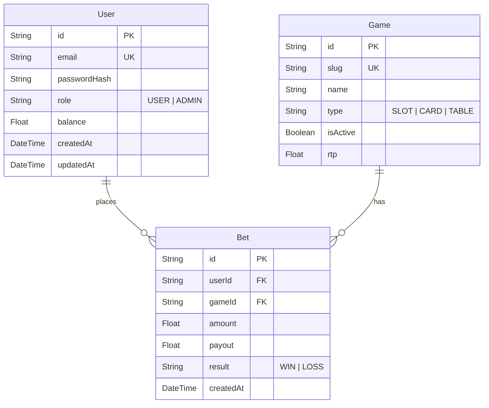

# Entity Relationship Diagram

```mermaid
erDiagram
    User ||--o{ Bet : places
    Game ||--o{ Bet : has

    User {
        String id PK
        String email UK
        String passwordHash
        String role "USER | ADMIN"
        Float balance
        DateTime createdAt
        DateTime updatedAt
    }

    Game {
        String id PK
        String slug UK
        String name
        String type "SLOT | CARD | TABLE"
        Boolean isActive
        Float rtp
    }

    Bet {
        String id PK
        String userId FK
        String gameId FK
        Float amount
        Float payout
        String result "WIN | LOSS"
        DateTime createdAt
    }
```
